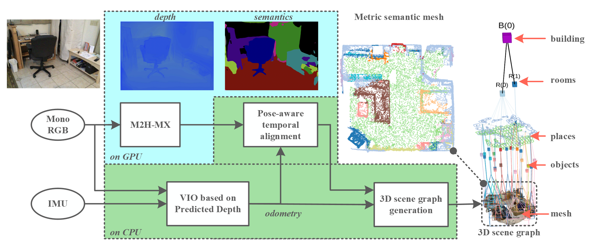

# Mono Hydra ROS 2

Mono Hydra ROS 2 is a Jazzy workspace for monocular 3D scene graph construction
from RGB, IMU, learned depth, and learned semantics. The stack keeps the
benchmarked Mono Hydra architecture: a custom `mono_hydra_vio` module uses a
classical R-VIO2 frontend for robust odometry, builds pose-graph and
loop-closure proposals following the Kimera design, and passes those proposals
to the official MIT SPARK Hydra backend for final scene-graph and mesh
optimization.



## Repository Layout

```text
mono_hydra              launch, dataset mappings, Hydra wiring, RViz
mono_hydra_vio          custom R-VIO2 + pose-graph/LCD VIO module
mono_hydra_perception   M2H-HMX-Large PyTorch/ONNX perception interface
mono_hydra_utils        vendored Hydra, Spark-DSG, Kimera-PGMO/RPGO, tools
images                  paper and README figures
```

This repository is intended to be cloned as the `src/` directory of a ROS 2
workspace so GitHub opens directly on the main packages:

```bash
mkdir -p ~/mono_hydra_ros2_ws
cd ~/mono_hydra_ros2_ws
git clone git@github.com:<owner>/<repo>.git src
```

Third-party source is vendored under `mono_hydra_utils`; no Git submodules are required.
The recorded upstream revisions are listed in [UPSTREAM_REPOS.md](UPSTREAM_REPOS.md).

## Pipeline

```text
RGB + IMU
  -> R-VIO2
  -> /rvio2/trajectory
  -> /external_odometry and /mono_hydra_vio/odometry
  -> mono_hydra_vio RGB-D/external-odometry pose graph
  -> loop-closure proposals following the Kimera LCD formulation
  -> Hydra GraphBuilder + Kimera-PGMO/Kimera-RPGO backend
  -> optimized mesh, rooms, objects, places, building, and 3D scene graph
```

The perception package publishes learned metric depth and semantic label IDs:

```text
/camera/depth_cam/image_raw        sensor_msgs/Image, 32FC1
/camera/seg_cam/labels_argmax      sensor_msgs/Image, mono8
/mono_hydra_perception/synced/*    RGB/CameraInfo paired with each prediction
```

## Model Weights

Model checkpoints and ONNX exports are not included in the public repository.
They are ignored by `.gitignore` to keep the journal-submission repository small
and redistributable.

Place local checkpoints under these paths inside this repository:

```text
mono_hydra_perception/weights/
mono_hydra_perception/onnx_models/
```

or pass them explicitly:

```bash
ros2 launch mono_hydra mono_hydra_itc_rosbag.launch.py \
  perception_checkpoint_path:=/path/to/m2h_hmx_large.pt
```

Loop-closure detection also needs the ORB vocabulary expanded locally:

```bash
cd src/mono_hydra_vio/vocabulary
unzip ORBvoc.zip
```

## Build

Use a modest build load for workstation thermals:

```bash
cd /home/bavantha/ros1_workspaces/ros2_jazzy_ws
source /opt/ros/jazzy/setup.bash
rosdep install --from-paths src --ignore-src -r -y
MAKEFLAGS="-j2" colcon build --symlink-install --continue-on-error \
  --parallel-workers 2
source install/setup.bash
```

## ITC Full-Loop Run

Convert the ROS 1 ITC bag once:

```bash
src/mono_hydra_utils/mono_hydra_utils/scripts/convert_itc_ros1_bag_to_ros2.sh \
  /home/bavantha/ros1_workspaces/hydra2_ws/data/itc/ITC_2nd_floor_full_loop.bag
```

Terminal 1:

```bash
cd /home/bavantha/ros1_workspaces/ros2_jazzy_ws
source install/setup.bash
ros2 launch mono_hydra mono_hydra_itc_rosbag.launch.py \
  sequence_name:=itc_full_loop use_rviz:=true perception_backend:=torch
```

Terminal 2:

```bash
cd /home/bavantha/ros1_workspaces/ros2_jazzy_ws
source install/setup.bash
ros2 bag play test_data/itc_ros2_bags/ITC_2nd_floor_full_loop_ros2 \
  --clock --rate 0.2 --qos-profile-overrides-path \
  "$(ros2 pkg prefix mono_hydra_utils)/share/mono_hydra_utils/config/tf_overrides.yaml" \
  --remap /tf:=/tf_ignore /tf_static:=/tf_static_ignore
```

Use the slower `--rate 0.2` playback for the full PyTorch model unless the GPU
has been validated to keep up. ONNX inference remains available only when
explicitly requested:

```bash
ros2 launch mono_hydra mono_hydra_itc_rosbag.launch.py \
  perception_backend:=onnx onnx_model_path:=/path/to/model.onnx
```

## Other Dataset Launches

```bash
ros2 launch mono_hydra mono_hydra_7scenes.launch.py \
  use_rviz:=true perception_backend:=torch

ros2 launch mono_hydra mono_hydra_uhumans.launch.py \
  use_rviz:=true perception_backend:=torch use_sparse_depth_factors:=true

ros2 launch mono_hydra mono_hydra_scannet.launch.py \
  use_rviz:=true perception_backend:=torch
```

Useful ablation switches:

```text
use_sparse_depth_factors
use_semantic_masking
superpoint_keypoint_mask_topic
use_temporal_alignment
kimera_do_coarse_imu_camera_temporal_sync
kimera_do_fine_imu_camera_temporal_sync
```

## Runtime Checks

```bash
ros2 topic hz /camera/depth_cam/image_raw
ros2 topic hz /camera/seg_cam/labels_argmax
ros2 topic hz /mono_hydra_perception/synced/image_raw
ros2 topic hz /mono_hydra_vio/odometry
ros2 topic info -v /mono_hydra_vio_ros/pose_graph_incremental
ros2 topic echo --once /hydra_dsg_visualizer/dsg_markers \
  --qos-durability transient_local --qos-reliability reliable --no-arr
ros2 run tf2_tools view_frames
```

After a full ITC loop, check Hydra PGMO density:

```bash
tail -n 1 output/itc_full_loop/backend/pgmo/dsg_pgmo_status.csv
```

The `trajectory_len` should be close to the ROS 1 full-loop scale rather than a
sparse partial run.

## Preparing the GitHub Repository

Generated products, bags, logs, local environments, and model artifacts are
ignored. The source tree is ready for a normal single-repository push:

```bash
git init
git add .
git status
git commit -m "Initial Mono Hydra ROS 2 release"
git branch -M main
git remote add origin git@github.com:<owner>/<repo>.git
git push -u origin main
```

## License

The original Mono Hydra ROS 2 integration code in this repository is released
under the MIT License; see [LICENSE](LICENSE). This does not relicense vendored
upstream code. MIT SPARK Hydra and the other third-party projects under
`mono_hydra_utils`, plus R-VIO2/vocabulary-derived components under
`mono_hydra_vio`, retain their upstream licenses. See
[THIRD_PARTY_NOTICES.md](THIRD_PARTY_NOTICES.md) and the license files in each
vendored source directory.

## Acknowledgements and Citation

This work builds on major open-source robotics systems:

- MIT SPARK Hydra and Hydra-ROS: https://github.com/MIT-SPARK/Hydra and
  https://github.com/MIT-SPARK/Hydra-ROS. Cite Hughes et al., “Hydra: A
  Real-time Spatial Perception System for 3D Scene Graph Construction and
  Optimization,” RSS, 2022.
- Kimera, Kimera-PGMO, and Kimera-RPGO:
  https://github.com/MIT-SPARK/Kimera-VIO,
  https://github.com/MIT-SPARK/Kimera-PGMO, and
  https://github.com/MIT-SPARK/Kimera-RPGO. The `mono_hydra_vio` pose-graph and
  loop-closure implementation follows the Kimera formulation; cite Rosinol et
  al., “Kimera: an Open-Source Library for Real-Time Metric-Semantic
  Localization and Mapping,” ICRA, 2020, and Rosinol et al., “Kimera: From SLAM
  to Spatial Perception with 3D Dynamic Scene Graphs,” IJRR, 2021.
- R-VIO / R-VIO2: https://github.com/rpng/R-VIO. Cite Huai and Huang,
  “Robocentric Visual-Inertial Odometry,” IJRR, and the square-root R-VIO2
  online spatiotemporal calibration work where applicable.
- GTSAM: https://github.com/borglab/gtsam. Cite Dellaert, “Factor Graphs and
  GTSAM: A Hands-on Introduction,” 2012.

Please also cite the Mono Hydra papers associated with this repository and the
M2H-HMX-Large perception model in journal submissions.
